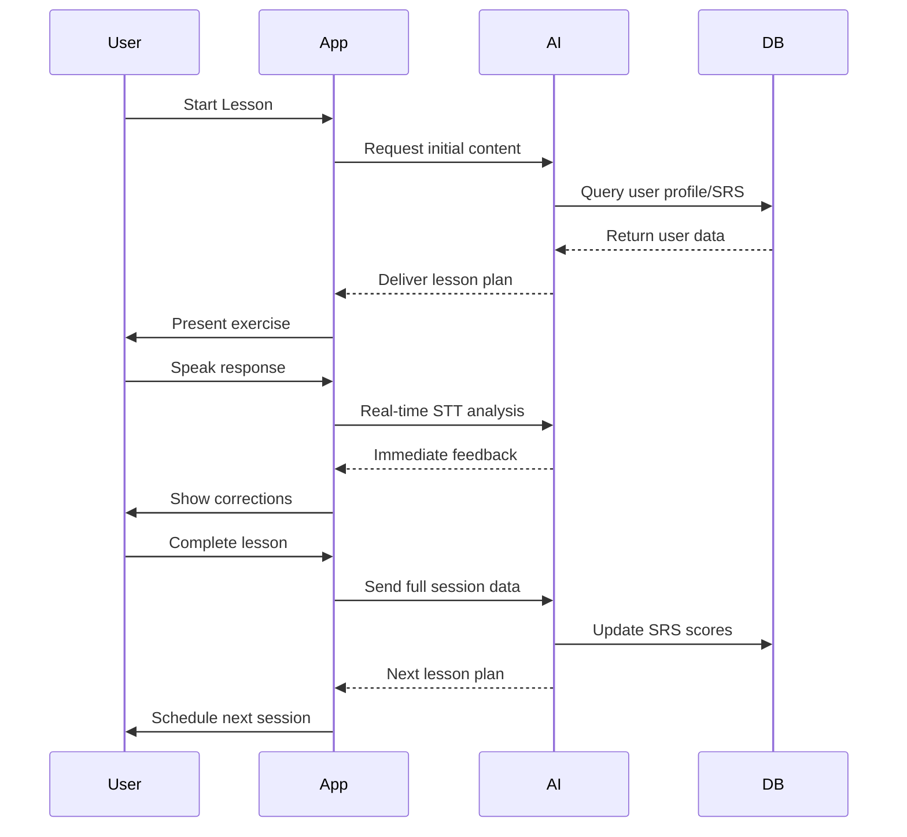
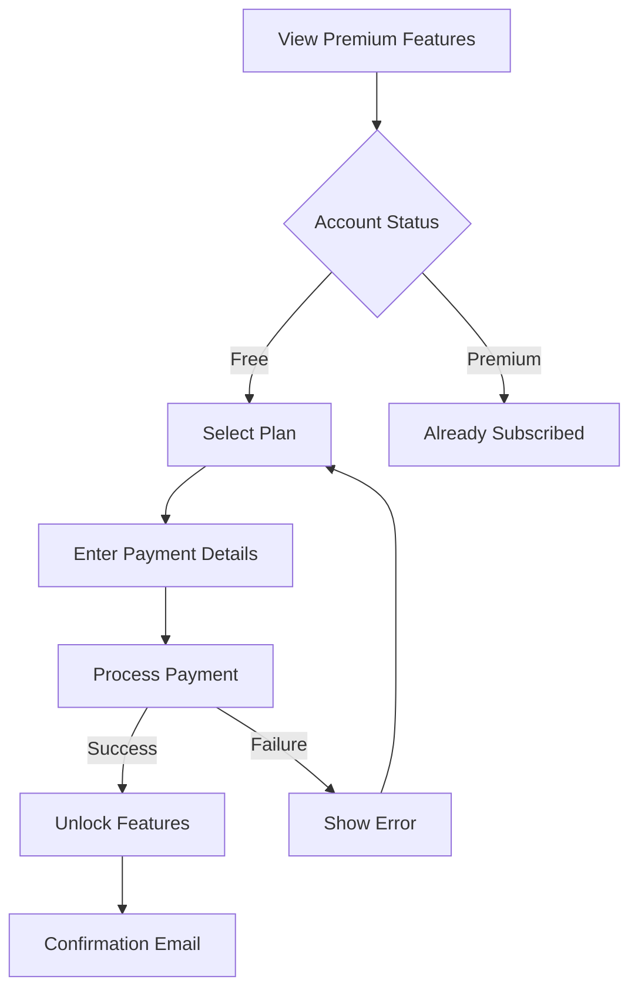

# BUSINESS REQUIREMENTS DOCUMENT
<!-- Document Version: 1.0 -->
<!-- Last Updated: 2025-06-11 -->

## 1. Project Overview
### 1.1 Purpose
This document defines the business requirements for the Lessay language learning platform, serving as the single source of truth for all functional and non-functional requirements.

### 1.2 Scope
**Included**:
- Core language learning features (lessons, exercises, progress tracking)
- User authentication and profile management
- Subscription and payment processing
- Basic reporting and analytics

**Excluded**:
- Third-party content partnerships
- Offline functionality
- Enterprise features

### 1.3 Objectives
1. Achieve 10,000 active users within 6 months of launch
2. Maintain 90% user satisfaction rate (measured weekly)
3. Process payments with 99.9% reliability
4. Support 5 languages by end of Q3

## 2. Business Context
### 2.1 Problem Statement
Traditional language learning methods often fail to provide:
- Personalized learning paths
- Real-time feedback
- Engaging, interactive content
- Affordable pricing models

### 2.2 Business Opportunities
1. Global language learning market growing at 18.7% CAGR
2. Increasing demand for interactive, app-based learning
3. Opportunity to disrupt traditional language schools
4. Potential for premium subscription revenue

## 3. Stakeholder Analysis
### 3.1 Key Stakeholders
| Role | Name | Responsibility |
|------|------|----------------|
| Product Owner | Jane Doe | Final requirements approval |
| Tech Lead | John Smith | Technical feasibility |
| UX Lead | Sarah Lee | User experience |
| Legal Counsel | Mike Chen | Compliance |

### 3.2 User Profiles
1. **Casual Learner**: Wants 5-10 min daily lessons
2. **Serious Student**: Needs structured curriculum
3. **Traveler**: Focuses on conversational skills
4. **Professional**: Requires business vocabulary

## 4. Functional Requirements
### 4.1 Feature Breakdown
1. **Adaptive Learning Engine**:
   - AI-generated lessons tailored to individual progress
   - Real-time speech-to-text feedback during exercises
   - Spaced Repetition System (SRS) for optimal retention
   - Post-session voice analysis for pronunciation diagnostics

2. **Progress Dashboard**:
   - Vocabulary mastery heatmap
   - Fluency metrics (pace, hesitation, filler words)
   - Error pattern analysis
   - SRS recall strength visualization

3. **Subscription Management**:
   - Three-tier model (Free, Premium, Pro)
   - Stripe integration for payments
   - Usage-based premium feature unlocking

4. **AI Analysis System**:
   - Real-time answer validation
   - Post-session diagnostic reports
   - Automated lesson planning
   - Continuous SRS score updates

### 4.2 User Workflows

**Adaptive Learning Loop:**

**Subscription Upgrade Flow:**

## 5. Non-Functional Requirements
### 5.1 Performance
- Real-time STT latency <300ms (p99)
- Post-session analysis completion <5s
- API response time <500ms (p95)
- Support 500 concurrent voice sessions
- Handle 5000 new users/day

### 5.2 Security
- PCI DSS Level 1 compliance
- GDPR/CCPA compliant voice data handling
- AES-256 encryption for audio storage
- Annual penetration testing
- Voice data retention policy (30 days)

### 5.3 AI & Voice Requirements
- LLM response quality: 95% accuracy
- STT accuracy: 90% for target languages
- TTS naturalness: 4/5 MOS score
- Diagnostic analysis consistency: 85% agreement with human raters
- Content generation: Zero hallucination policy

## 6. Success Metrics
### 6.1 KPIs
- Monthly Active Users (MAU)
- Lesson completion rate
- Payment success rate
- Customer support tickets

### 6.2 Acceptance Criteria
1. 95% of lessons load within 2 seconds
2. Payment processing success rate ≥ 99%
3. User registration takes < 1 minute
4. App receives 4+ star rating average