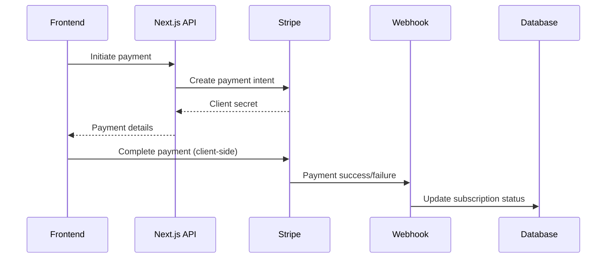

# MONETIZATION STRATEGY
<!-- Document Version: 1.0 -->
<!-- Last Updated: 2025-06-10 -->

## 1. Pricing Model
### 1.1 Subscription Tiers
| Tier | Price | Features |
|------|-------|----------|
| Free | $0 | Basic lessons, Limited voice practice, Basic SRS tracking |
| Premium | $9.99/month | All lessons, Full voice features, Progress dashboard, Advanced SRS analytics |
| Pro | $19.99/month | Premium features + Certification, Priority support, Unlimited voice analysis |

### 1.2 In-App Purchases
- Specialized lesson packs: $4.99-$14.99
- Certification badges: $9.99
- Detailed voice analysis reports: $0.99/report (complementary to standard analysis)

## 2. Stripe Integration
### 2.1 Architecture

### 2.2 Key Components
- **Stripe Account**: Connected mode for platform payments
- **Webhook Handler**: /api/stripe/webhook
- **Subscription Manager**: CRON job for recurring billing

## 3. Revenue Reporting
### 3.1 Metrics Tracked
- MRR (Monthly Recurring Revenue)
- Churn rate
- LTV (Customer Lifetime Value)
- ARPU (Average Revenue Per User)

### 3.2 Analytics Integration
- Stripe Dashboard
- Internal reporting system
- Tax compliance reporting

## 4. Security & Compliance
- PCI DSS Level 1 compliant
- Tokenized payment processing
- GDPR-compliant data handling