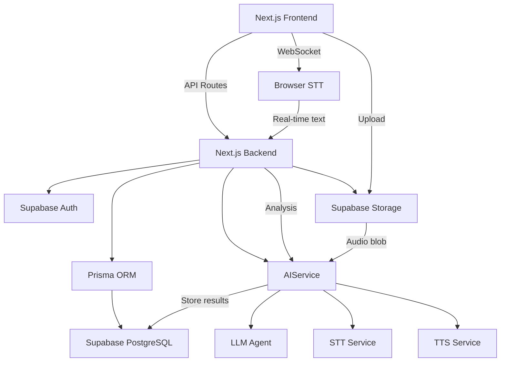
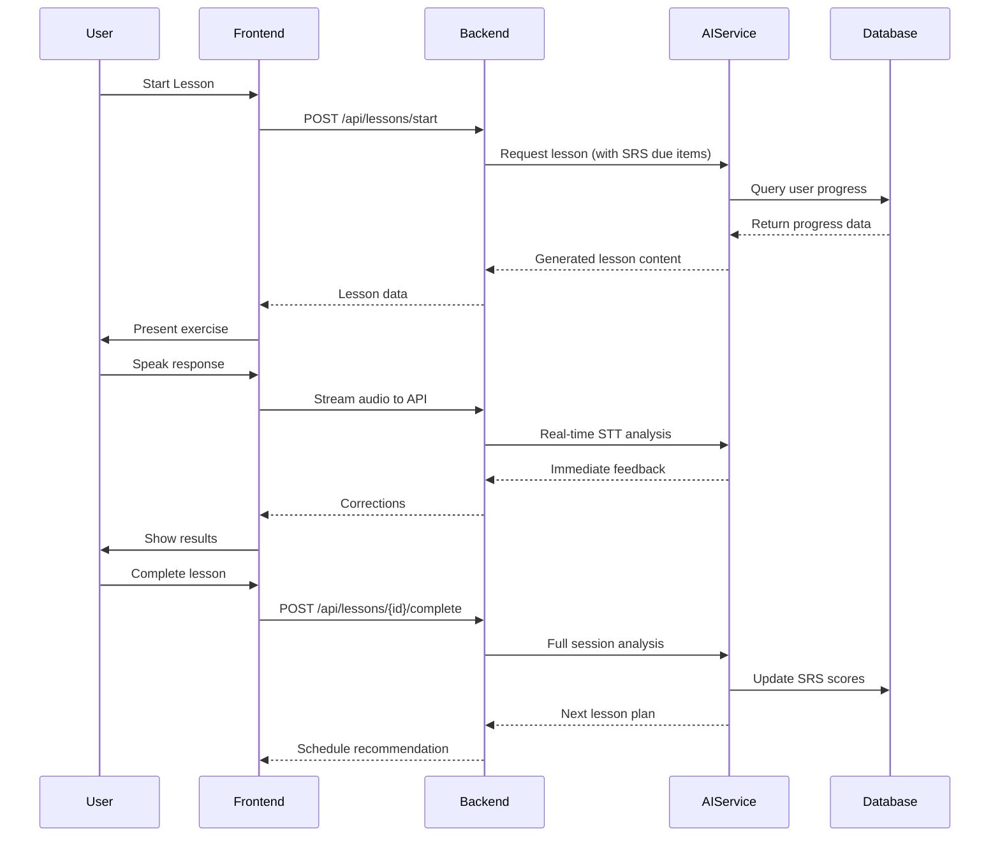
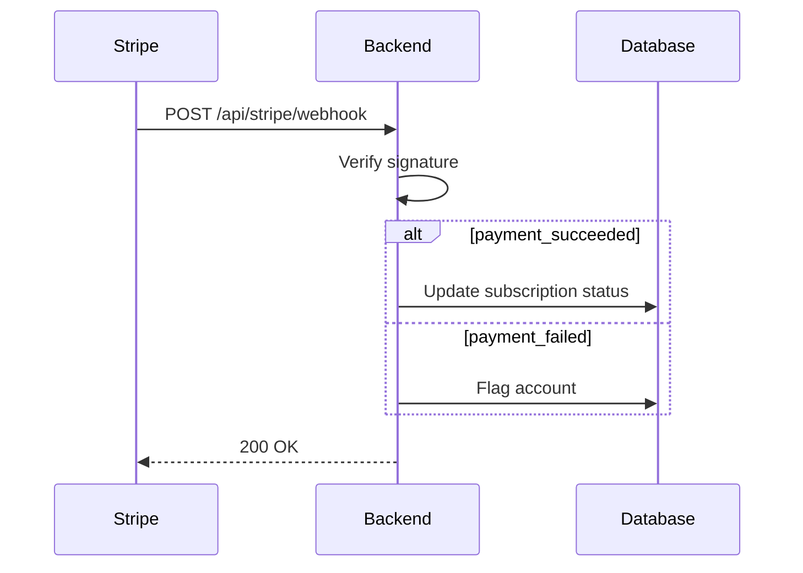

# TECHNICAL DESIGN DOCUMENT
<!-- Document Version: 1.2 -->
<!-- Last Updated: 2025-06-10 -->

## 1. Architecture Overview
### 1.1 System Context


### 1.2 Key Features
- **Language Learning Core**:
  - Adaptive lesson generation
  - Progress tracking
  - Voice interaction handling
- **AI Integration**:
  - Autonomous development agent
  - Content personalization
  - Error correction

## 2. Component Design
### 2.1 Service Layer
- **AuthService**:
  - JWT verification
  - Session management
  - Mock auth implementation (`MOCK_AUTH=true`)
  
- **DataService**:
  ```mermaid
  flowchart LR
      A[API Route] --> B[DataService]
      B --> C[Prisma Client]
      C --> D[(PostgreSQL)]
      B --> E[Cache Layer]
  ```
  - Manages:
    - User profiles
    - Learning content
    - Progress data

- **AIService**:
  ```mermaid
  flowchart LR
      A[API Request] --> B{AIService}
      B --> C[Lesson Generation]
      B --> D[Voice Analysis]
      C --> E["Prompt:
      'Generate a lesson for {user} focusing on
      {weaknesses} using {SRS} schedule'"]
      D --> F["Analysis:
      - Pronunciation scoring
      - Hesitation detection
      - Fluency metrics"]
      E --> G[LLM Response]
      F --> H[Diagnostic Report]
  ```
  
  **Example Lesson Generation Payload**:
  ```json
  {
    "userId": "uuid",
    "targetLanguage": "es",
    "focusAreas": ["past_tense", "travel_vocab"],
    "srsDueItems": ["comer", "viajar"],
    "difficultyLevel": 3
  }
  ```
  
  **Voice Analysis Parameters**:
  ```prisma
  model VoiceAnalysis {
    id        String @id @default(uuid())
    userId    String
    lessonId  String
    metrics   Json // {pace: 120, accuracy: 0.85, ...}
    audioUrl  String
    createdAt DateTime @default(now())
  }
  ```

## 3. Data Flow
### 3.1 Adaptive Learning Loop


### 3.2 Subscription Webhook Flow


## 4. Interface Specifications
### 4.1 AI Endpoints
| Method | Path | Description |
|--------|------|-------------|
| POST   | /api/ai/generate-lesson | Create personalized lesson |
| POST   | /api/ai/analyze-response | Evaluate user input |

## 5. Database Design
### 5.1 Complete Schema
```prisma
model User {
  id           String @id @default(uuid())
  email        String @unique
  password     String
  targetLang   String
  nativeLang   String
  progress     UserProgress[]
  srsEntries   SRSEntry[]
  lessons      Lesson[]
  createdAt    DateTime @default(now())
}

model Lesson {
  id          String @id @default(uuid())
  userId      String
  user        User @relation(fields: [userId], references: [id])
  exercises   Exercise[]
  completedAt DateTime?
  analysis    VoiceAnalysis[]
}

model Exercise {
  id          String @id @default(uuid())
  type        String // 'vocabulary', 'grammar', etc.
  content     Json
  difficulty  Int
  language    String
  tags        String[]
  lesson      Lesson @relation(fields: [lessonId], references: [id])
  lessonId    String
}

model UserProgress {
  id          String @id @default(uuid())
  userId      String
  user        User @relation(fields: [userId], references: [id])
  metric      String // 'vocabulary', 'grammar', etc.
  score       Float
  lastUpdated DateTime @default(now())
}

model SRSEntry {
  id             String @id @default(uuid())
  userId         String
  user           User @relation(fields: [userId], references: [id])
  item           String // word or grammar concept
  recallStrength Float @default(1.0)
  nextReview     DateTime @default(now())
  language       String
  @@index([userId, nextReview])
}

model VoiceAnalysis {
  id        String @id @default(uuid())
  userId    String
  user      User @relation(fields: [userId], references: [id])
  lessonId  String
  lesson    Lesson @relation(fields: [lessonId], references: [id])
  metrics   Json // {pace: 120, accuracy: 0.85, ...}
  audioUrl  String
  createdAt DateTime @default(now())
}
```

## 6. Non-Functional Considerations
### 6.1 AI Performance
- Model inference optimization
- Async task processing
- Rate limiting

### 6.2 Language Processing
- Multilingual support
- Voice data handling
- Real-time feedback