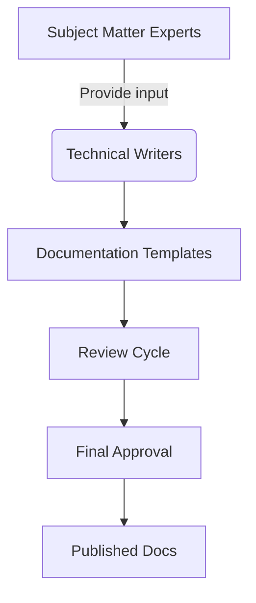
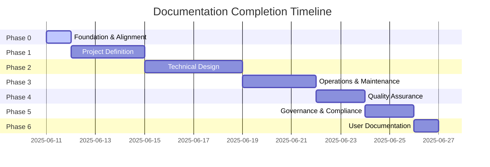

# Documentation Completion Plan

## 1. Documentation Audit Summary
- **Total templates**: 16
- **Complete templates**: 7 
  (api_spec, compliance_framework, data_governance, deployment_playbook, monetization_strategy, technical_design, test_plan)
- **Incomplete templates**: 9 
  (BRD, change management, continuous improvement, FRS, maintenance guide, performance baseline, project charter, risk assessment, user docs)
- **Missing sections**: 58 across all templates

## 2. Content Creation Strategy

### Content Sourcing:
- **Technical specifications**: Engineering team
- **Business requirements**: Product owners
- **Compliance details**: Legal team
- **User workflows**: UX researchers

## 3. Prioritization Framework

## 4. Implementation Plan (Phased Approach)

### Phase 0: Foundation and Alignment (1 day)
- Ingest and analyze all files from repomix-output.xml
- Validate vision alignment across all documents
- Update this master plan with detailed phased tasks

### Phase 1: Project Definition & Requirements (3 days)
- Complete Project Charter with success criteria and timeline
- Finalize Business Requirements Document (BRD)
- Develop detailed Functional Requirements Specification (FRS)

### Phase 2: Architecture & Technical Design (4 days)
- Expand Technical Design Document with data flows and schemas
- Develop comprehensive API Specification
- Define database models using Prisma schema syntax

### Phase 3: Implementation, Operations & Maintenance (3 days)
- Enhance Deployment Playbook with environment configs
- Complete Maintenance Guide with alert thresholds
- Document diagnostic tools and recovery processes

### Phase 4: Quality Assurance & Performance (2 days)
- Expand Test Plan with core feature test cases
- Define performance baselines and load testing scenarios

### Phase 5: Governance, Risk, and Compliance (2 days)
- Complete Risk Assessment for AI/voice-specific risks
- Develop Change Management and Continuous Improvement plans

### Phase 6: User-Facing Documentation (1 day)
- Create complete User Documentation with troubleshooting guides

## 5. Quality Assurance
- Automated checks for:
  - Placeholder text detection
  - Broken links
  - Compliance markers
- Manual checks for:
  - Technical accuracy
  - Consistency across documents
  - Readability scores

## 6. Completion Metrics
- **Success criteria**:
  - All 18 documentation templates completed
  - 100% alignment with app_description.md vision
  - Complete technical specifications for AI/voice features
  - Detailed test cases for all core functionality
  - Comprehensive risk mitigation strategies documented
- **Tracking**:
  - Daily progress against phased milestones
  - Automated checks for documentation integrity
  - Final validation by development team lead