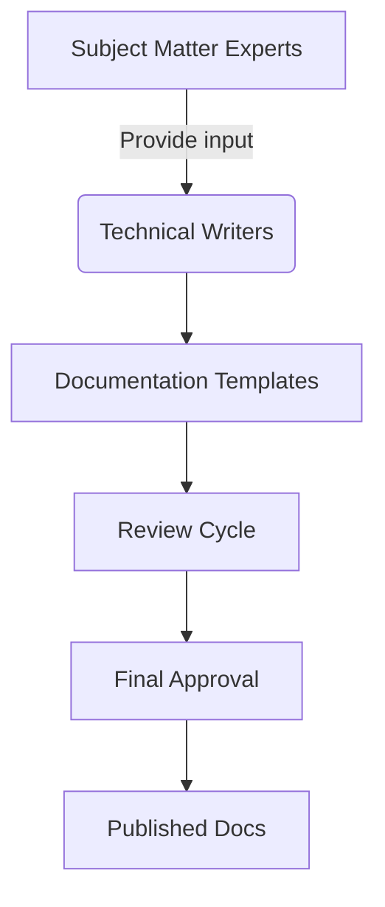
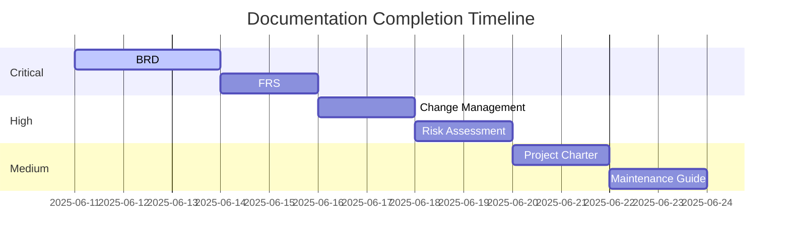

# Documentation Completion Plan

## 1. Documentation Audit Summary
- **Total templates**: 16
- **Complete templates**: 7 
  (api_spec, compliance_framework, data_governance, deployment_playbook, monetization_strategy, technical_design, test_plan)
- **Incomplete templates**: 9 
  (BRD, change management, continuous improvement, FRS, maintenance guide, performance baseline, project charter, risk assessment, user docs)
- **Missing sections**: 58 across all templates

## 2. Content Creation Strategy

### Content Sourcing:
- **Technical specifications**: Engineering team
- **Business requirements**: Product owners
- **Compliance details**: Legal team
- **User workflows**: UX researchers

## 3. Prioritization Framework

## 4. Implementation Plan

### Phase 1: Information Gathering (1 day)
- Conduct stakeholder interviews
- Collect existing specifications
- Map requirements to template sections

### Phase 2: Content Development (5 days)
- Assign templates to technical writers
- Use standardized writing guidelines
- Implement version control for documents

### Phase 3: Review & Approval (2 days)
- Technical review by engineering leads
- Compliance review by legal team
- Final sign-off by product owners

## 5. Quality Assurance
- Automated checks for:
  - Placeholder text detection
  - Broken links
  - Compliance markers
- Manual checks for:
  - Technical accuracy
  - Consistency across documents
  - Readability scores

## 6. Completion Metrics
- **Success criteria**:
  - 0 placeholder comments
  - 100% section completion
  - All tables populated
  - Approval from 3 stakeholder groups
- **Tracking**: Weekly progress reports