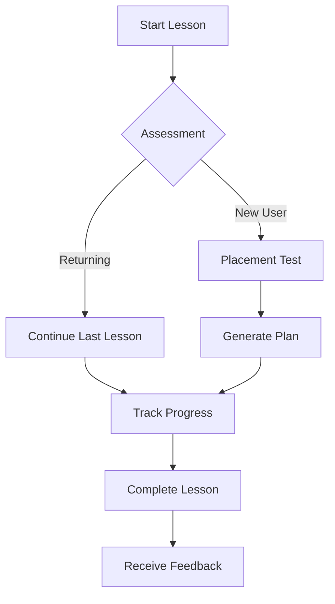

# BUSINESS REQUIREMENTS DOCUMENT
<!-- Document Version: 1.0 -->
<!-- Last Updated: DATE -->

## 1. Project Overview
### 1.1 Purpose
This document defines the business requirements for the Lessay language learning platform, serving as the single source of truth for all functional and non-functional requirements.

### 1.2 Scope
**Included**:
- Core language learning features (lessons, exercises, progress tracking)
- User authentication and profile management
- Subscription and payment processing
- Basic reporting and analytics

**Excluded**:
- Third-party content partnerships
- Offline functionality
- Enterprise features

### 1.3 Objectives
1. Achieve 10,000 active users within 6 months of launch
2. Maintain 90% user satisfaction rate (measured weekly)
3. Process payments with 99.9% reliability
4. Support 5 languages by end of Q3

## 2. Business Context
### 2.1 Problem Statement
Traditional language learning methods often fail to provide:
- Personalized learning paths
- Real-time feedback
- Engaging, interactive content
- Affordable pricing models

### 2.2 Business Opportunities
1. Global language learning market growing at 18.7% CAGR
2. Increasing demand for interactive, app-based learning
3. Opportunity to disrupt traditional language schools
4. Potential for premium subscription revenue

## 3. Stakeholder Analysis
### 3.1 Key Stakeholders
| Role | Name | Responsibility |
|------|------|----------------|
| Product Owner | Jane Doe | Final requirements approval |
| Tech Lead | John Smith | Technical feasibility |
| UX Lead | Sarah Lee | User experience |
| Legal Counsel | Mike Chen | Compliance |

### 3.2 User Profiles
1. **Casual Learner**: Wants 5-10 min daily lessons
2. **Serious Student**: Needs structured curriculum
3. **Traveler**: Focuses on conversational skills
4. **Professional**: Requires business vocabulary

## 4. Functional Requirements
### 4.1 Feature Breakdown
1. **Adaptive Lessons**:
   - AI-generated content based on user level
   - Real-time pronunciation feedback
   - Progressively difficult exercises

2. **Subscription Management**:
   - Multiple tier options
   - Payment method management
   - Usage analytics

### 4.2 User Workflows

## 5. Non-Functional Requirements
### 5.1 Performance
- API response time < 500ms (p95)
- Support 100 concurrent lessons
- Handle 1000 new users/day

### 5.2 Security
- PCI DSS compliance for payments
- GDPR compliance for EU users
- Regular penetration testing

### 5.3 Scalability
- Horizontal scaling to 10 nodes
- Auto-scaling based on CPU usage
- Multi-region deployment capability

## 6. Success Metrics
### 6.1 KPIs
- Monthly Active Users (MAU)
- Lesson completion rate
- Payment success rate
- Customer support tickets

### 6.2 Acceptance Criteria
1. 95% of lessons load within 2 seconds
2. Payment processing success rate ≥ 99%
3. User registration takes < 1 minute
4. App receives 4+ star rating average