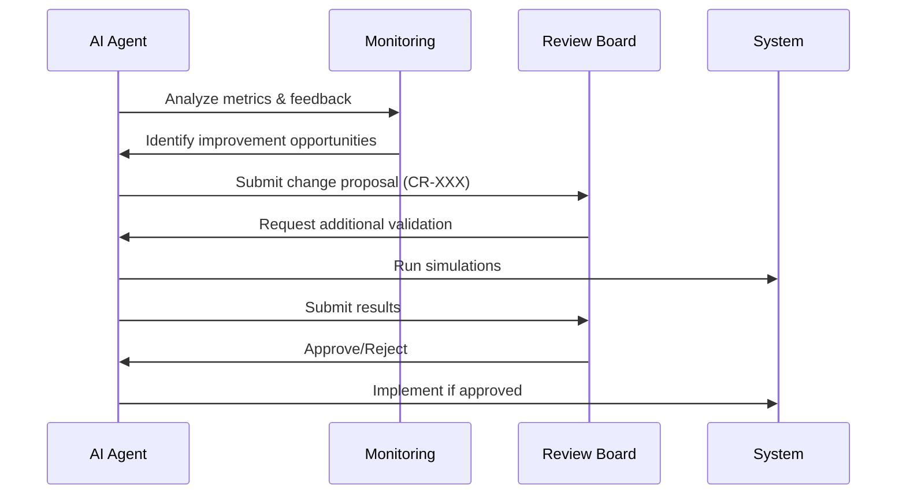

# CHANGE MANAGEMENT TEMPLATE
<!-- Document Version: 1.0 -->
<!-- Last Updated: 2025-06-11 -->

## 1. Change Request Process
### 1.1 AI-Proposed Changes

### 1.2 Change Request Form
### 1.1 Change Details
| Field | Description | Example |
|-------|-------------|---------|
| Change ID | CR-{YYYYMMDD}-{SEQ} | CR-20250610-001 |
| Requestor | Initiating team/member | Backend Team |
| Date | Change request date | 2025-06-10 |
| Description | Detailed change description | "Add new payment method type for regional providers" |
| Reason | Business/technical justification | "Support alternative payment methods in Southeast Asia market" |

### 1.2 Impact Analysis
- **Affected Components**:
  - Payment processing service
  - User profile database
  - Billing UI
- **Risk Assessment**: Medium (requires database migration)
- **Downtime Expected**: No (feature flag implementation)

## 2. AI Change Management
### 2.1 Autonomous Implementation Guardrails
1. **Safety Checks**:
   - Performance impact simulation
   - Security vulnerability scan
   - Compliance audit
   - User experience review

2. **Rollback Triggers**:
   - Error rate increase >5%
   - Performance degradation >20%
   - User satisfaction drop >15%
   - Security/compliance violation

### 2.2 Approval Workflow
### 2.1 Review Process
| Step | Role | Action | SLA | Date |
|------|------|--------|-----|------|
| 1    | AI Agent | Automated validation | 1h | Immediate |
| 2    | Security Bot | Compliance check | 15m | Continuous |
| 3    | Product Owner | Final approval | 1d | Next business day |

### 2.2 Implementation Plan
- **Target Release**: v2.3.0 (2025-06-21)
- **Rollback Strategy**:
  - Feature flag disable
  - Database migration rollback script
  - API version fallback

## 3. Change Log
| Change ID | Description | Status | Implemented Version | Owner |
|-----------|-------------|--------|---------------------|-------|
| CR-20250515-002 | Add voice recording feature | Completed | v2.2.0 | Frontend Team |
| CR-20250520-003 | Update Stripe API version | In Progress | v2.3.0 | Backend Team |
| CR-20250601-004 | New language content (Spanish) | Planned | v2.4.0 | Content Team |