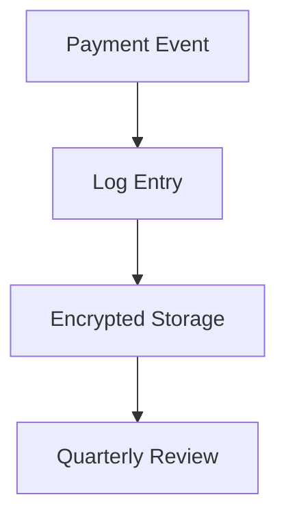

# COMPLIANCE FRAMEWORK TEMPLATE
<!-- Document Version: 1.1 -->
<!-- Last Updated: 2025-06-10 -->

[Existing sections...]

## 3. Payment Compliance
### 3.1 PCI DSS Requirements
- **SAQ A** compliance level
- No card data storage
- Quarterly vulnerability scans

### 3.2 GDPR Financial Data
- Legal basis: Contractual necessity
- Right to erasure limitations
- Breach notification timeline: 72 hours

### 3.3 Audit Controls

## 4. Certification Status
- PCI DSS: Annual assessment
- GDPR: Continuous compliance
- SOC 2: Planned for 2026