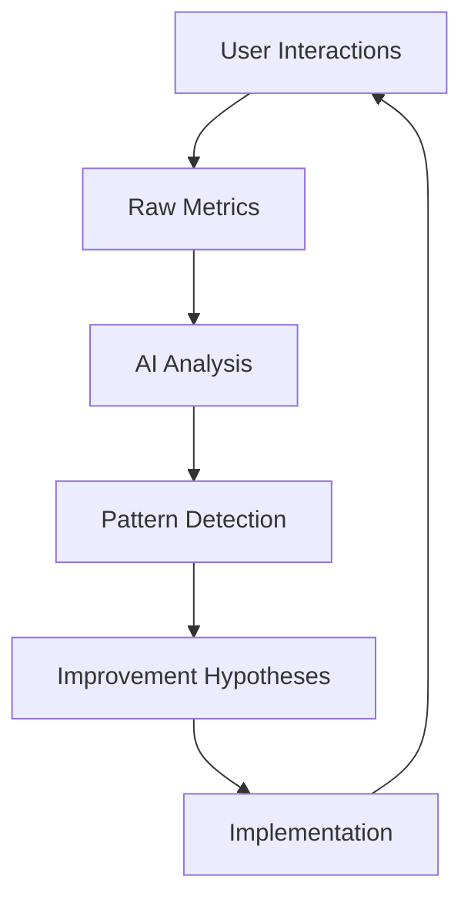
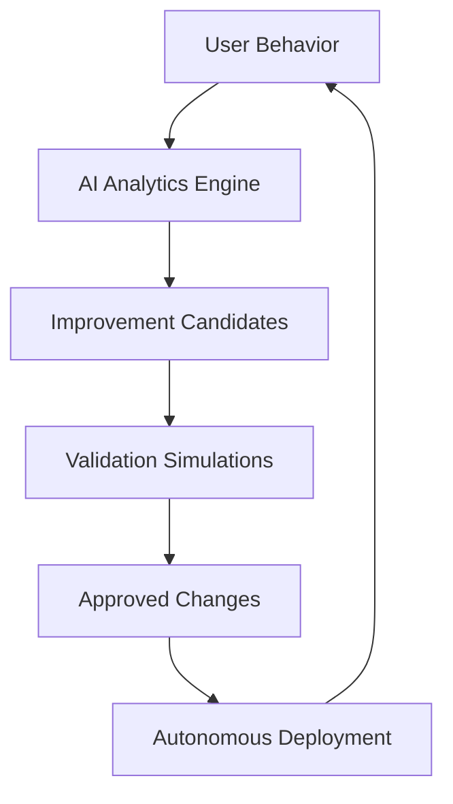

# CONTINUOUS IMPROVEMENT PLAN TEMPLATE
<!-- Document Version: 1.0 -->
<!-- Last Updated: 2025-06-11 -->

## 1. AI-Driven Improvement Cycle
### 1.1 Continuous Learning Process

### 1.2 Feedback Management
### 1.1 Collection Channels
- **Quantitative**:
  - Voice analysis trends
  - SRS effectiveness rates
  - Feature usage analytics
  - Error frequency heatmaps
  
- **Qualitative**:
  - Sentiment analysis of reviews
  - Support ticket clustering
  - User interview transcripts
  - Feature request patterns

### 1.2 Prioritization Framework
| Metric | Weight | AI Processing | Output |
|--------|--------|---------------|--------|
| User Satisfaction | 40% | Sentiment analysis | Feature adjustments |
| Business Impact | 30% | Revenue modeling | Monetization features |
| Technical Debt | 20% | Code quality scans | Refactoring tasks |
| Strategic Alignment | 10% | Roadmap analysis | Long-term investments |

## 2. Iteration Planning
### 2.1 Improvement Backlog
| ID | Description | Status | Target Release | Owner |
|----|-------------|--------|----------------|-------|
| CI-001 | Implement dark mode | Planned | v2.4 | Frontend Team |
| CI-002 | Add pronunciation analytics | In Progress | v2.3 | AI Team |
| CI-003 | Improve lesson loading speed | Backlog | v2.5 | Perf Team |

### 2.2 Retrospective Process
1. **Data Review** (30 mins):
   - Metrics comparison (before/after)
   - Key incidents analysis
2. **Discussion** (60 mins):
   - What went well?
   - What could be improved?
   - Action items
3. **Follow-up**:
   - Document decisions
   - Assign action items
   - Schedule check-ins

## 3. Technical Debt
### 3.1 Debt Inventory
| Area | Description | Severity | Remediation Plan |
|------|-------------|----------|------------------|
| API | Legacy authentication | High | Migrate to OAuth 2.0 |
| DB | Missing indexes | Medium | Add performance-critical indexes |
| UI | jQuery dependencies | Low | Rewrite in React |

### 3.2 Paydown Schedule
- **Q2 2025**: Address high-severity items
- **Q3 2025**: Complete medium-severity items
- **Q4 2025**: Review and prioritize remaining debt
- **Ongoing**: Allocate 20% sprint capacity to debt

## 4. Metrics & Reporting
### 4.1 Improvement Metrics
- Weekly velocity (story points)
- Bug escape rate (prod vs staging)
- Cycle time (commit to deploy)
- User satisfaction (CSAT)
- Feature adoption rate

### 4.2 Progress Dashboard
