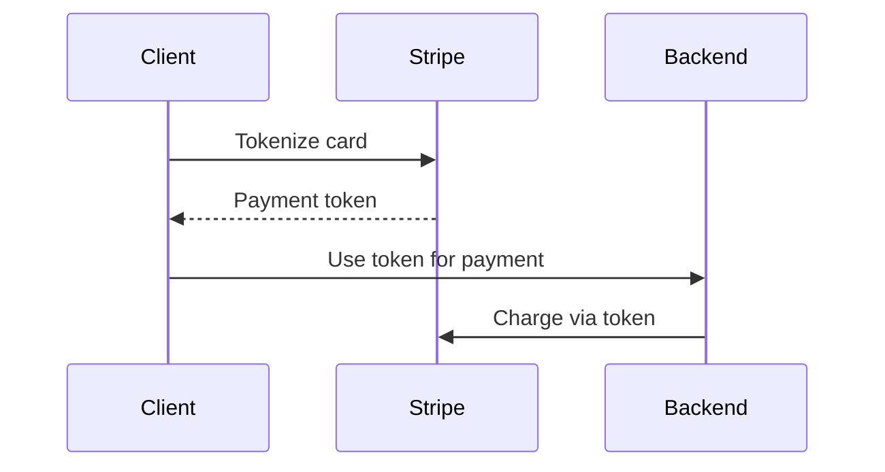

# DATA GOVERNANCE FRAMEWORK TEMPLATE
<!-- Document Version: 1.1 -->
<!-- Last Updated: 2025-06-10 -->

[Existing sections...]

## 4. Payment Data Handling
### 4.1 Data Types
| Classification | Examples | Handling Requirements |
|----------------|----------|-----------------------|
| Sensitive | Stripe customer IDs | Encrypted storage |
| Restricted | Payment tokens | Never stored locally |

### 4.2 Security Controls
- **Encryption**: AES-256 for payment metadata
- **Access**: Role-based, limited to billing team
- **Audit**: All access logged and monitored

### 4.3 Tokenization Flow

## 5. Data Retention
### 5.1 Payment Metadata
- Retention period: 7 years (tax compliance)
- Deletion method: Cryptographic shredding