# PERFORMANCE BASELINE TEMPLATE
<!-- Document Version: 1.0 -->
<!-- Last Updated: 2025-06-11 -->

## 1. Testing Methodology
### 1.1 Load Testing
- Tools:
  - k6 (load testing)
  - Locust (stress testing)
  - Prometheus (metrics collection)
  - Grafana (visualization)
- Scenarios:
  - 500 concurrent lessons
  - 1000 dashboard requests
  - Peak hour traffic simulation

### 1.2 Stress Testing
- Breaking points:
  - API: ~1500 req/s
  - Database: ~500 concurrent connections
  - Voice Processing: ~300 concurrent streams
- Recovery procedures:
  - Auto-scaling triggers at 70% CPU
  - Queue fallback for voice processing
  - Database read replicas during peaks

## 2. Performance Metrics
### 2.1 Key Indicators
| Metric | Target | Measurement |
|--------|--------|-------------|
| API Response (p95) | <300ms | Prometheus |
| STT Latency (p99) | <500ms | Cloud Monitoring |
| Concurrent Lessons | 500 | k6 |
| Dashboard Load | 1000 req/min | Grafana |
| Error Rate | <1% | Datadog |
| Voice Processing | <5s turnaround | Internal metrics |

### 2.2 Benchmark Results
### 2.2 Example Benchmarks

```mermaid
gantt
    title Performance Test Results
    dateFormat X
    axisFormat %s
    section API
    300ms Target : 0, 300
    Actual p95 : 0, 285
    section STT
    500ms Target : 0, 500
    Actual p99 : 0, 480
    section Lessons
    500 Concurrent Target : 0, 500
    Actual Achieved : 0, 510
```

## 3. Scalability
### 3.1 Horizontal Scaling
- Nodes:
  - Baseline: 3
  - Max tested: 10
- Performance gain:
  - Linear scaling to 5 nodes
  - Diminishing returns after 8 nodes

### 3.2 Vertical Scaling
- Resource increases:
  - CPU: 2 → 4 cores
  - Memory: 4GB → 8GB
- Impact:
  - 40% faster response times
  - 2x throughput capacity