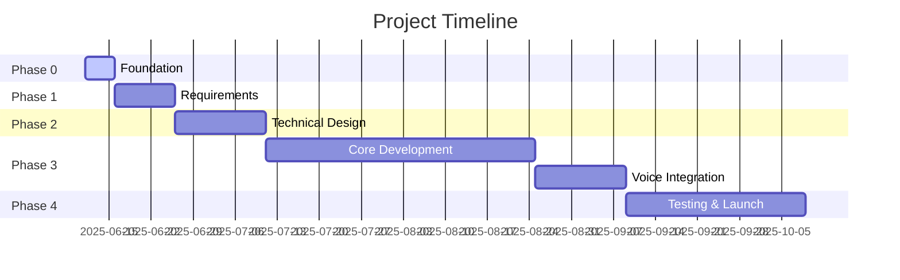

# PROJECT CHARTER TEMPLATE
<!-- Document Version: 1.0 -->
<!-- Last Updated: 2025-06-11 -->

## 1. Project Overview
### 1.1 Vision Statement
To create an AI-powered language learning platform that listens, understands, and adapts to each learner through continuous voice analysis and Spaced Repetition (SRS), transforming every interaction into measurable progress toward fluency.

### 1.2 Objectives
- Launch with English, Spanish and French by Q3 2025
- Achieve 15% improvement in vocabulary recall (measured by SRS) within 30 days
- Maintain <300ms latency for real-time voice analysis
- Process 95% of payments through Stripe integration

### 1.3 Success Criteria
- 15% improvement in vocabulary recall over 30 days (SRS metric)
- 10% reduction in pronunciation errors per month (voice analysis)
- <300ms latency for real-time speech-to-text
- 90% user retention at 30 days

## 2. Scope
### 2.1 In Scope
- Adaptive lesson engine with SRS
- Real-time voice analysis pipeline
- Progress dashboard with fluency metrics
- Stripe payment integration
- AI-driven diagnostics system

### 2.2 Out of Scope
- Offline functionality
- Social features
- Classroom management tools
- Third-party content marketplace

## 3. Stakeholders
### 3.1 Key Stakeholders
| Role | Name | Responsibility |
|------|------|----------------|
| Product Owner | Jane Doe | Final requirements approval |
| Tech Lead | John Smith | Technical oversight |
| UX Lead | Sarah Lee | User experience |
| Marketing Lead | Alex Wong | Go-to-market strategy |

### 3.2 Steering Committee
Composed of:
- CTO (chair)
- VP Product
- Head of Engineering
- Finance Director
Meets bi-weekly to review progress and approve major changes

## 4. Timeline
### 4.1 Key Milestones
| Milestone | Date | Owner |
|-----------|------|-------|
| Requirements Finalized | 2025-06-25 | Jane Doe |
| Core Engine Complete | 2025-08-15 | John Smith |
| Voice Analysis Integrated | 2025-09-01 | John Smith |
| Beta Launch | 2025-09-15 | Sarah Lee |
| Full Release | 2025-10-01 | Alex Wong |

### 4.2 High-Level Schedule
