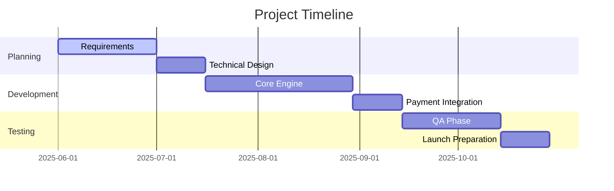

# PROJECT CHARTER TEMPLATE
<!-- Document Version: 1.0 -->
<!-- Last Updated: DATE -->

## 1. Project Overview
### 1.1 Vision Statement
To create an AI-powered language learning platform that delivers personalized, adaptive lessons with real-time feedback, making language acquisition accessible and effective for everyone.

### 1.2 Objectives
- Launch MVP with 3 languages by Q3 2025
- Achieve 10,000 active users within 6 months
- Maintain 90% user satisfaction rate
- Process payments with 99.9% reliability

### 1.3 Success Criteria
- 80% of users complete at least 5 lessons/month
- Average lesson rating ≥ 4.5/5 stars
- Payment success rate ≥ 99%
- <500ms API response time (p95)

## 2. Scope
### 2.1 In Scope
- Core lesson delivery engine
- User authentication system
- Subscription management
- Basic progress tracking
- Payment processing integration

### 2.2 Out of Scope
- Offline functionality
- Social features
- Classroom management tools
- Third-party content marketplace

## 3. Stakeholders
### 3.1 Key Stakeholders
| Role | Name | Responsibility |
|------|------|----------------|
| Product Owner | Jane Doe | Final requirements approval |
| Tech Lead | John Smith | Technical oversight |
| UX Lead | Sarah Lee | User experience |
| Marketing Lead | Alex Wong | Go-to-market strategy |

### 3.2 Steering Committee
Composed of:
- CTO (chair)
- VP Product
- Head of Engineering
- Finance Director
Meets bi-weekly to review progress and approve major changes

## 4. Timeline
### 4.1 Key Milestones
| Milestone | Date | Owner |
|-----------|------|-------|
| Requirements Finalized | 2025-06-30 | Jane Doe |
| MVP Development Complete | 2025-09-15 | John Smith |
| Beta Launch | 2025-10-01 | Sarah Lee |
| Full Release | 2025-11-15 | Alex Wong |

### 4.2 High-Level Schedule
