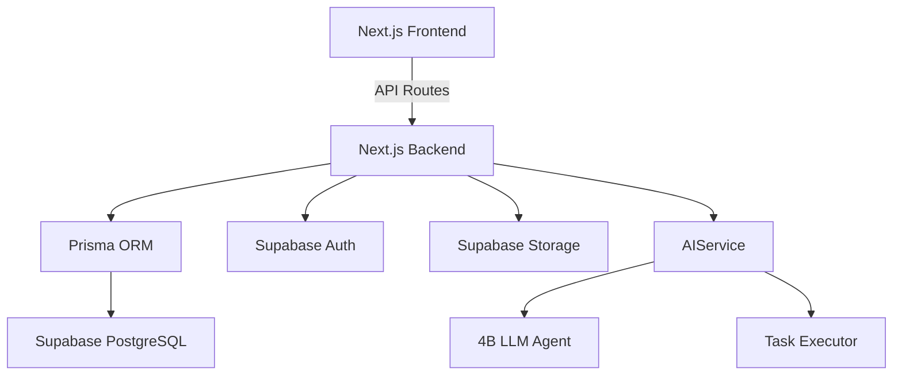
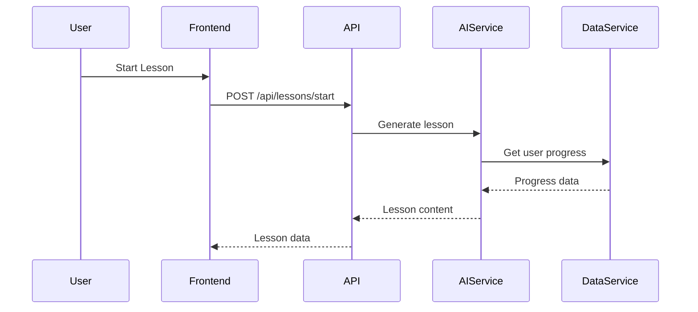

# TECHNICAL DESIGN DOCUMENT
<!-- Document Version: 1.2 -->
<!-- Last Updated: 2025-06-10 -->

## 1. Architecture Overview
### 1.1 System Context


### 1.2 Key Features
- **Language Learning Core**:
  - Adaptive lesson generation
  - Progress tracking
  - Voice interaction handling
- **AI Integration**:
  - Autonomous development agent
  - Content personalization
  - Error correction

## 2. Component Design
### 2.1 Service Layer
- **AuthService**:
  - JWT verification
  - Session management
  - Mock auth implementation (`MOCK_AUTH=true`)
  
- **DataService**:
  ```mermaid
  flowchart LR
      A[API Route] --> B[DataService]
      B --> C[Prisma Client]
      C --> D[(PostgreSQL)]
      B --> E[Cache Layer]
  ```
  - Manages:
    - User profiles
    - Learning content
    - Progress data

- **AIService**:
  - As previously detailed

## 3. Data Flow
### 3.1 Key Flows


## 4. Interface Specifications
### 4.1 AI Endpoints
| Method | Path | Description |
|--------|------|-------------|
| POST   | /api/ai/generate-lesson | Create personalized lesson |
| POST   | /api/ai/analyze-response | Evaluate user input |

## 5. Database Design
### 5.1 Extended Schema
```prisma
model Exercise {
  id          String @id @default(uuid())
  type        String // 'vocabulary', 'grammar', etc.
  content     Json
  difficulty  Int
  language    String
  tags        String[]
}
```

## 6. Non-Functional Considerations
### 6.1 AI Performance
- Model inference optimization
- Async task processing
- Rate limiting

### 6.2 Language Processing
- Multilingual support
- Voice data handling
- Real-time feedback