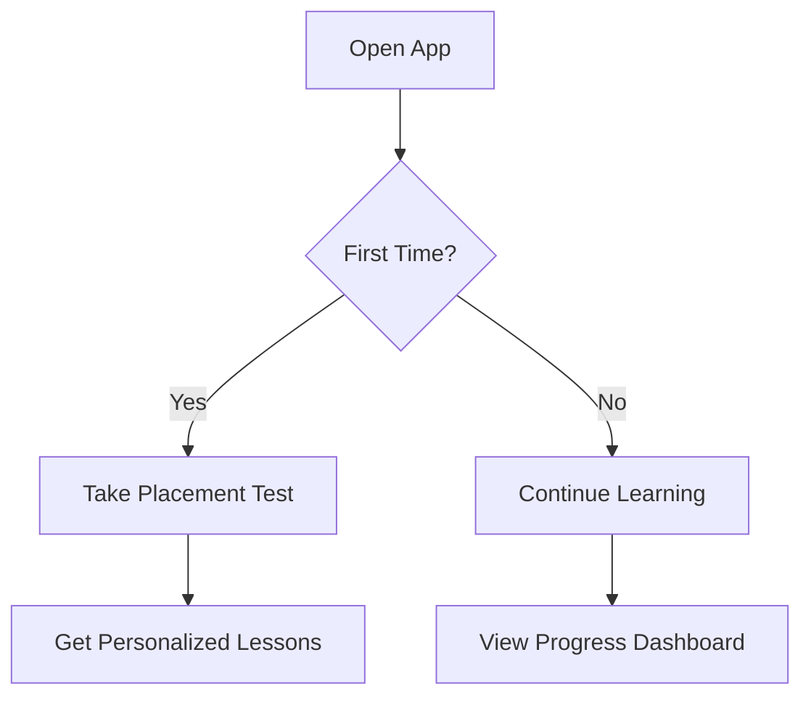
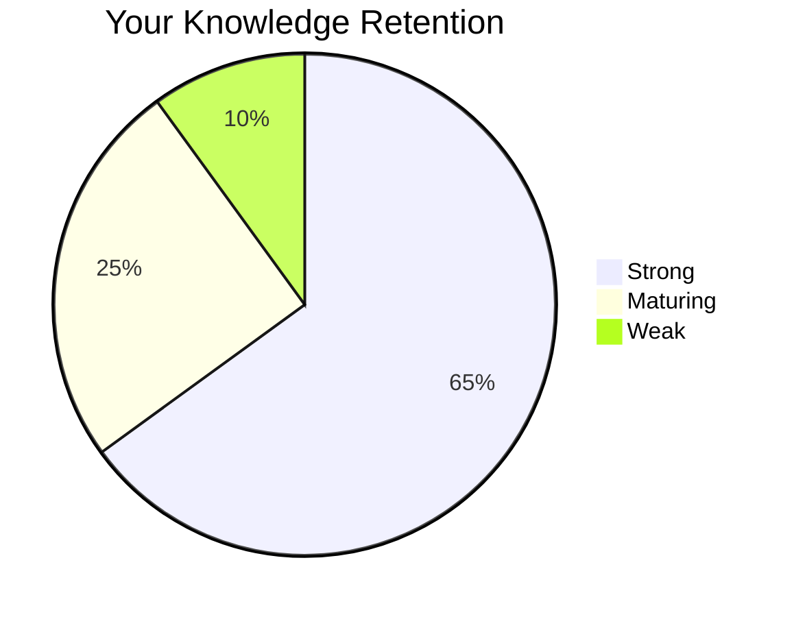
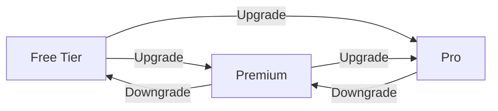

# USER DOCUMENTATION TEMPLATE
<!-- Document Version: 1.1 -->
<!-- Last Updated: 2025-06-11 -->

## 1. Getting Started
### 1.1 Language Selection

### 1.2 Your First Lesson
1. Open the app daily
2. Complete suggested exercises
3. Speak clearly when prompted
4. Review feedback immediately
5. Track progress over time

## 2. Learning Features
### 2.1 Progress Dashboard
- **Vocabulary Mastery**: Heatmap of known words
- **Fluency Metrics**: Speaking pace & hesitation trends
- **Error Patterns**: Common mistakes highlighted
- **Activity Log**: History of completed lessons

### 2.2 Spaced Repetition (SRS)

### 2.3 Fluency Analysis
- Pronunciation accuracy scores
- Speaking pace measurements
- Hesitation and filler word tracking
- Comparative analysis over time

## 4. Subscription Management
### 4.1 Choosing a Plan

### 4.2 Payment Process
1. Navigate to Settings > Subscription
2. Select desired plan
3. Enter payment details
4. Confirm purchase

### 4.3 Managing Your Subscription
- **Update Payment Method**: Settings > Billing
- **Change Plan**: Instant effect with prorated charges
- **Cancel**: Ends at billing period end

### 4.4 Troubleshooting
| Issue | Solution |
|-------|----------|
| Voice not recognized | Check microphone permissions |
| Incorrect feedback | Use "Report Error" button |
| Lesson too hard/easy | Adjust difficulty in settings |
| Progress not saving | Check internet connection |
| Payment issues | Update card or contact support |