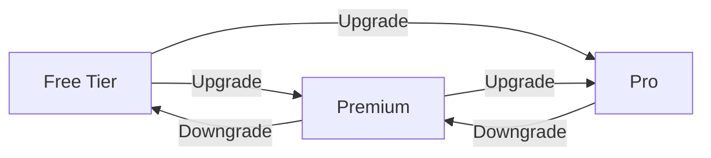

# USER DOCUMENTATION TEMPLATE
<!-- Document Version: 1.1 -->
<!-- Last Updated: 2025-06-10 -->

[Existing sections...]

## 4. Subscription Management
### 4.1 Choosing a Plan

### 4.2 Payment Process
1. Navigate to Settings > Subscription
2. Select desired plan
3. Enter payment details
4. Confirm purchase

### 4.3 Managing Your Subscription
- **Update Payment Method**: Settings > Billing
- **Change Plan**: Instant effect with prorated charges
- **Cancel**: Ends at billing period end

### 4.4 Troubleshooting
| Issue | Solution |
|-------|----------|
| Payment failed | Update card details |
| Wrong charge | Contact support |
| Canceled by mistake | Reactivate within 7 days |